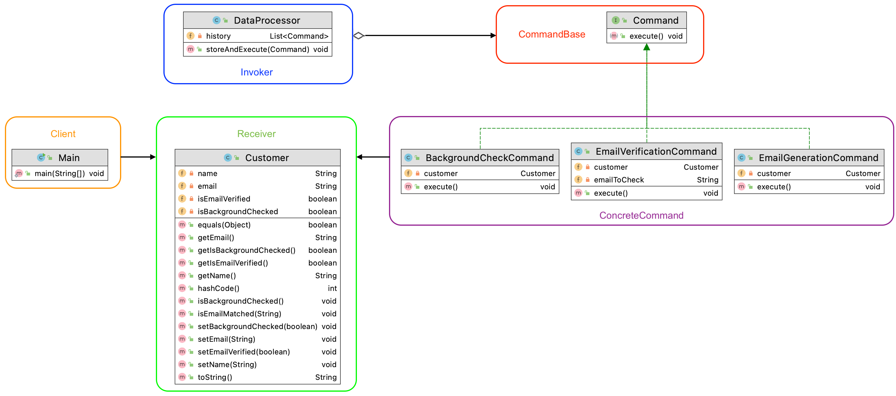

Author: Luxi Meng   
Date: 04/30/2021
------------------

# Description

This project focuses on a shop's customer data system, it will receive and convert customer request data from new to the
old format. It will also have an email address verification as well as a background check function. I used adapter pattern
for this design.

In my design, CustomerData will be extended by two other interface, CustomerDataManagementSystem, which is the new
system, as well as the CustomerDataOld, which is the old system interface. The two sub-interface will be further
implemented by their respective concrete class. The new system will act as an adapter for the old system when received
customer request

Features:

• Implementation Flexibility, e.g., how you add or remove in future new types?
* My design is flexible because if I want to add or remove any more different system, or add more common feature/function
  that they will have,  I can easily add a subclass without affecting the abstract/interface, the integrity of the
  superclass remains unchanged.

• Simplicity and understandability
* My system is easy to understand because it does not require you to fully understand the old system. By introducing the
adaptor pattern

• Avoided duplicated code 
* I avoid duplicated code by utilize layers of interfaces for customer data, and the proxy can call function from the
  real subject.
------------
#Assumption

Assume that old system CustomerDataOld will only intake email and verify emails, and it could return welcome email if
customer data passed email verification, and return reject email if failed email verification. Assume that new system
will intake email, phone, and background check info, and it will return welcome email only when all three matched existing
data.


* **Composing Methods**:  
      Some methods need refactoring with method names, parameters or method body for potential use for Adaptor pattern.
* **Moving Features Between Objects**:  
      To optimize part 2 (customer data processing), I need to utilize Command pattern, create classes for that pattern
      and move related features into the new classes.

------------------

## 2. Composing Methods

Instead of "for loop", I used the getCustomer() method in OldSystem with stream and lambda to optimize the
searching of customer from customer data list. Also, I extract the getCustomer() method from new system into adaptor,
then call it in new system, in this way the **Adaptor** pattern can be implemented and works well in my new design with
related unit tests.

## 3. Moving Features Between Objects

UML for part 2: Customer Data Processing (Command pattern)



To optimize customer data processing part, I use **Command** pattern with Command interface, three different concrete
command subclasses, and a DataProcessor class as the Invoker in Command pattern. I moved two methods isEmailMatched()
and isBackgroundChecked() from the OldSystem class into Customer class itself. Then I can call it from related concrete
command class, to implement email verification and background check functions.

With this **Command** pattern now I can create different command objects to operate email verification, background
check, and generate output emails based on related results. In Main.main() I set up three examples:

* a customer passed the email verification and background check -> welcome email will be generated
* a customer's email verification failed, but background check passed-> rejection email will be generated
* a customer verified the email, but didn't pass background check -> rejection email will be generated

Example output is as following:

```bash
---- Part 2: Customer Data Processing ----
Example 2.1 : email verification and background check pass -> welcome email will be generated
David Griffin's Email is verified as david_4@gmail.com
David Griffin's background check passed.
Welcome Email: Welcome to the system, David Griffin

Example 2.2 : email verification fail -> rejection email will be generated
em@gmail.com cannot be verified.
Eliana Mantle's background check passed.
Rejection email: Sorry, your email address is not verified. Please check your email to verify.

Example 2.3 : Background check fail -> rejection email will be generated
Elizabeth Leonard's Email is verified as elileo6@gmail.com
Elizabeth Leonard's background check did not pass.
Rejection email: Sorry, your background check is passed.
```

------------------


